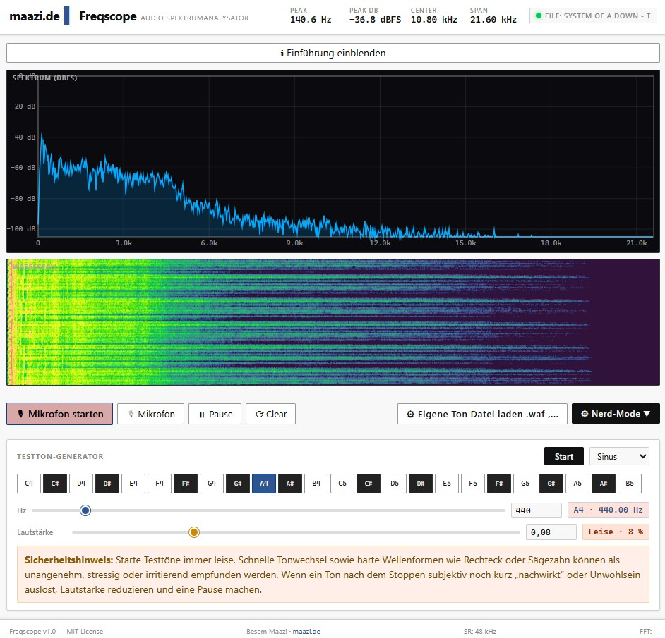

# 🎛️ freqscope



> **Browserbasierter Echtzeit-Spektrumanalyer** — ohne Installation, ohne Backend, direkt im Browser.

[](LICENSE)
[](https://vitejs.dev)
[](https://developer.mozilla.org/en-US/docs/Web/API/Web_Audio_API)
[](https://hub.docker.com)

---

## Was ist freqscope?

**freqscope** macht das Unsichtbare sichtbar: Es zeigt dir in Echtzeit, **welche Töne und Frequenzen** in einem Klang stecken — direkt im Browser, mit deinem Mikrofon.

### Einfach erklärt

Stell dir vor, du hörst Musik. Mit freqscope siehst du sofort:

- Welche **Töne** spielen gerade (Bässe, Mitten, Höhen)
- Wie **laut** jede Frequenz ist
- Wie sich das Klangbild **über die Zeit** verändert (Wasserfall)

### Für wen ist das?

| Zielgruppe             | Nutzen                                                 |
| ---------------------- | ------------------------------------------------------ |
| 🎵 Musiker             | Mikrofon testen, Raumakustik analysieren               |
| 🔧 Techniker           | Signalanalyse, Netzbrumm orten, Audiogeräte prüfen     |
| 🎓 Schüler & Studenten | Physik- und Elektrotechnik-Konzepte live erleben       |
| 🧪 Hobbyisten          | Einfach Töne visualisieren und experimentieren         |
| 💼 Engineers           | SCPI-Terminal, DSP-Parameter, professioneller Workflow |

---

## Features im Überblick

### Echtzeit-Analyse

- **Spektrum-Diagramm** (FFT) — zeigt alle Frequenzen gleichzeitig
- **Wasserfall-Diagramm** — zeigt den Verlauf über die Zeit (wie ein Sonar)
- **Peak-Erkennung** — findet automatisch die dominante Frequenz
- **Einführungs-Banner** mit Messgeräte-Erklärung, jederzeit ein- und ausblendbar
- **Pegel-Anzeige** in dBFS (professionelle Einheit für Lautstärke)

### Testton-Generator

- Eingebauter **Sinusgenerator** zum Testen ohne externe Geräte
- Klaviatur-Interface mit **24 Noten** (C4 bis B5)
- Wellenformen: **Sinus, Rechteck, Sägezahn, Dreieck**
- Frequenz per **Slider** (20–4000 Hz) oder direkte Eingabe (bis 20 kHz)
- **Lautstärkeregler** mit leiser Start-Einstellung für vorsichtiges Einpegeln
- Automatische **Notenname-Anzeige** (z.B. „A4 · 440.00 Hz")

### Nerd-Mode (für Profis)

- **FFT-Größe** einstellbar: 1024, 2048, 4096, 8192 Punkte
- **Smoothing** (Glättung) für stabilere Anzeige
- **Peak-Hold**: Signal-Spitzen werden eingefroren
- **Farbkarten**: Viridis, Turbo, Plasma, Graustufen, uvm.
- **SCPI-Terminal**: Steuerung per Messgeräte-Protokoll

### Datei-Analyse

- Audio-Dateien direkt **per Drag & Drop** oder Datei-Dialog laden
- Unterstützt alle Browser-Formate (MP3, WAV, OGG, FLAC, ...)

### SCPI-Terminal (Advanced)

SCPI ist das Standardprotokoll für professionelle HF-Messgeräte. freqscope simuliert ein solches Gerät vollständig:

```text
*IDN?                    → Geräte-ID abfragen
:SENS:FREQ:CENT?         → Center-Frequenz lesen
:SENS:FREQ:CENT 1000     → Center-Frequenz setzen
:SENS:FREQ:SPAN?         → Frequenz-Span lesen
:TRAC:DATA? TRACE1       → Messdaten als JSON exportieren
```

---

## Schnellstart (lokal ausprobieren)

### Voraussetzungen

- [Node.js](https://nodejs.org) (Version 18 oder neuer)
- Ein Webbrowser (Chrome, Firefox, Edge)

### Schritte

```bash
# 1. Repository klonen
git clone https://github.com/ATOMICMBAG/freqscope.git
cd freqscope

# 2. Abhängigkeiten installieren
npm install

# 3. Entwicklungsserver starten
npm run dev
```

Dann im Browser öffnen: **http://localhost:5173**

### Erster Test

1. Klicke auf **„Mikrofon starten"** und erlaube den Zugriff
2. Pfeife oder klaps in die Hände — das Spektrum reagiert sofort
3. Oder: Scrolle nach unten zum **Testton-Generator** und klicke auf **„A4"**  
   → Du siehst eine schmale Kurve bei 440 Hz im Spektrum

> Die Einführung oben in der App lässt sich jederzeit über den Button
> **„ℹ Einführung ein-/ausblenden“** wieder anzeigen oder verbergen.

---

## Aufgepasst & gelernt

Beim Testton-Generator gab es bereits einen typischen WebAudio-Fallstrick:

- Der interne Oszillator-Zustand muss in der Audio-Engine **explizit initialisiert** werden
- Beim Wechsel zwischen **Mikrofon**, **Datei-Wiedergabe** und **Testton** müssen alte Audioquellen **sauber gestoppt und getrennt** werden
- Browser geben Audio oft erst nach einer **echten Benutzeraktion** frei (z.B. Klick auf `Start` oder eine Note)

### Konkret in freqscope

Der Fix in `src/audio.js` stellt sicher, dass:

- `this._osc` beim Start sauber mit `null` initialisiert ist
- der Testton über einen separaten **GainNode** mit kontrollierbarer Lautstärke läuft
- `startMic()`, `loadFile()` und `stop()` vorhandene Oszillator-/Datei-/Mikrofonquellen korrekt aufräumen
- der Testton-Generator stabil zwischen den Signalquellen umschaltet, ohne in einem inkonsistenten Zustand zu landen

### Neue Schutzmaßnahme

Zusätzlich besitzt der Testton-Generator jetzt:

- einen **Lautstärkeregler** mit bewusst **leiser Standard-Einstellung**
- einen sichtbaren **Sicherheitshinweis** direkt an der Testton-Sektion
- robustere Umschaltung zwischen **Mikrofon**, **Datei** und **Testton** in der UI
- ein professioneller formuliertes **Einführungs-Banner** für Audio-, SDR- und HF-Interessierte

### Wenn der Testton trotzdem stumm bleibt

Prüfe nacheinander:

1. Ist die Browser-Tab **nicht stummgeschaltet**?
2. Wurde der Testton per **Klick** gestartet (nicht nur per Reload geöffnet)?
3. Ist ein anderes Audiogerät als Ausgabegerät aktiv?
4. Läuft gerade noch Mikrofon- oder Datei-Wiedergabe, die zuerst gestoppt werden sollte?

### Sicherheit bei Testtönen

- Testtöne immer **leise starten** und dann langsam erhöhen
- **Rechteck** und **Sägezahn** klingen deutlich schärfer und unangenehmer als Sinus
- Schnelle Tonwechsel oder hohe Pegel können **Stress, Hörermüdung oder Unwohlsein** auslösen
- Wenn ein Ton nach dem Stoppen subjektiv noch kurz „nachwirkt“, besser eine **Pause** machen und leiser weiter testen

---

## Wer will kann Deployment auf VPS (Docker(n))

### Für wen ist das?

Wenn du freqscope dauerhaft im Internet hosten möchtest — z.B. auf einem günstigen VPS (Virtual Private Server).

### Anforderungen

- Linux-Server mit Docker installiert
- Optional: Eine eigene Domain (für HTTPS)

### Schritt für Schritt

```bash
# 1. Projekt auf den Server kopieren
git clone https://github.com/ATOMICMBAG/freqscope.git
cd freqscope

# 2. Container bauen und starten
docker compose up -d --build

# 3. Prüfen ob alles läuft
docker compose ps
# → sollte "healthy" anzeigen
```

Die App läuft jetzt auf **Port 4173**: `http://deine-server-ip:4173`

> **HTTPS ist Pflicht für Mikrofon!**  
> Browser erlauben Mikrofon-Zugriff nur über HTTPS oder localhost.  
> Für HTTPS: Certbot + Nginx Reverse-Proxy verwenden (siehe [DEPLOY.md](DEPLOY.md)).

### Docker-Befehle im Alltag

```bash
docker compose logs -f freqscope    # Live-Logs anzeigen
docker compose restart freqscope   # Neustart
docker compose down                 # Stoppen
git pull && docker compose up -d --build  # Update deployen
```

---

## Technischer Aufbau

```
freqscope/
├── src/
│   ├── main.js       # Hauptlogik, Event-Handler, Render-Loop
│   ├── audio.js      # WebAudio API: Mikrofon, Datei, Testton-Oszillator, Analyser
│   ├── spectrum.js   # Spektrum-Rendering (Canvas)
│   ├── waterfall.js  # Wasserfall-Rendering (Canvas)
│   ├── dsp.js        # DSP-Algorithmen: Smoother, Peak-Hold, FFT
│   ├── scpi.js       # SCPI-Parser & Instrument-State-Machine
│   ├── config.js     # Konfiguration (FFT-Size, Farben, dB-Range)
│   ├── colormaps.js  # Farbpaletten für Wasserfall
│   └── style.css     # UI-Styles
├── index.html        # Single-Page-App
├── Dockerfile        # Multi-stage Build (Node → Nginx)
├── docker-compose.yml
├── nginx.conf        # Gzip, Caching, Security-Headers
└── vite.config.js
```

### Technologien

| Technologie      | Wozu                                         |
| ---------------- | -------------------------------------------- |
| **WebAudio API** | Mikrofon-Zugriff, FFT, Oszillator            |
| **Canvas API**   | Echtzeit-Rendering von Spektrum & Wasserfall |
| **Vite**         | Build-Tool (schnell, modern)                 |
| **Nginx**        | Statischer Webserver im Docker-Container     |
| **Docker**       | Einfaches Deployment, überall lauffähig      |

---

## Typische Messergebnisse

| Signal              | Was du siehst                                       |
| ------------------- | --------------------------------------------------- |
| 440 Hz Sinuston     | Einzige schmale Spitze bei 440 Hz                   |
| Netzbrumm (Elektro) | Peak bei 50 Hz (Europa) oder 60 Hz (USA)            |
| Sprache             | Breiter Berg von ~100 Hz bis ~3 kHz                 |
| Musik (Bass)        | Mehrere harmonische Spitzen, verstärkt unter 200 Hz |
| Stille / Rauschen   | Gleichmäßige niedrige Linie bei ca. −100 dBFS       |

---

## Design-Philosophie

freqscope sieht aus wie ein **professionelles Messgerät**, nicht wie eine bunte Demo-App:

- Weißer Hintergrund, schwarze Schrift — klar und lesbar
- Minimale Rundungen (max. 2-3 px Border-Radius)
- Zahlen links ausgerichtet, wie auf echten Instrumenten
- Kein Schnickschnack — jedes Element hat einen Zweck

---

## DSP-Hintergrund (für Interessierte)

**FFT** (Fast Fourier Transform) ist der mathematische Kern von freqscope:

- Es teilt ein Tonsignal in seine **Frequenzbestandteile** auf
- Größere FFT-Size = **mehr Frequenzauflösung** (aber langsamer)
- **Smoothing** mittelt mehrere Frames → ruhigeres Bild
- **Peak-Hold** "friert" Spitzen ein → hilfreich bei kurzen Signalen
- **Wasserfall**: Jede neue Spektrum-Zeile wird oben eingefügt, ältere rutschen nach unten

---

## Konfiguration

Die wichtigsten Einstellungen findest du in `src/config.js`:

```javascript
dsp: {
  fftSize: 4096,      // FFT-Größe (mehr = genauer, aber langsamer)
  smoothing: 0.8,     // Glättung 0–1 (0 = aus, 1 = sehr smooth)
  peakHold: 60,       // Peak-Hold in Frames (0 = aus)
},
display: {
  dbMin: -120,        // Untergrenze dBFS
  dbMax: 0,           // Obergrenze dBFS
  colormap: "turbo",  // Farbpalette für Wasserfall
}
```

---

## Lizenz

MIT License — frei verwendbar, auch kommerziell.  
Details: [LICENSE](LICENSE)

---

## Autor

**Besem Maazi**

- Projektsite: [freqscope.maazi.de](https://freqscope.maazi.de)
- GitHub: [@ATOMICMBAG](https://github.com/ATOMICMBAG)
- Website: [maazi.de](https://maazi.de)

---

_ ^_^ freqscope v1.0 — „Das Unsichtbare sichtbar machen."\_
